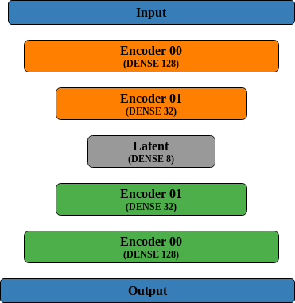

# ASAP: A Dynamic & Proactive Approach for *A*ndroid *S*ecurity *A*nalysis and *P*rivacy

The main objective of this work is to identify which mobile applications violate user privacy, through the analysis of the requested permissions for execution.

We selected two datasets with the android applications permissions: Android Permission Dataset and Exodus Dataset.
The class distribution between malicious and benign applications is really unbalanced.

Our proposed solution leverages an AutoEncoder trained to reproduce the Android permissions of benign applications.
This means a well-trained AutoEncoder should accurately reconstruct benign applications, while malicious ones with different permission profiles will have a large reconstruction error. Therefore, a simple threshold algorithm can be used to separate benign from malicious applications.
To establish a dynamic threshold level, we employ a variant of the ISODATA thresholding method that utilizes the median instead of the average. This approach is more robust for skewed reconstruction error distributions.

## Authors

* [**Catarina Silva**](mailto:c.alexandracorreia@ua.pt)

* [**João Felizberto**](mailto:joaofelisberto@ua.pt)

## License

This project is licensed under the MIT License - see the [LICENSE](LICENSE) file for details.
